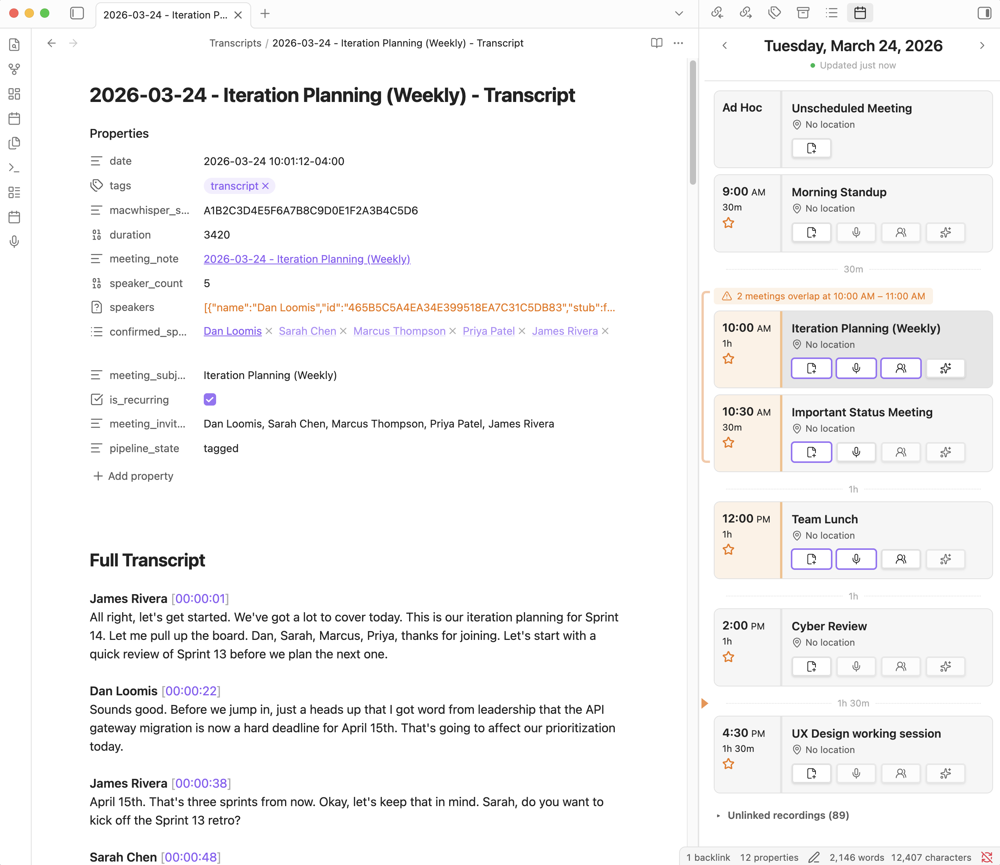
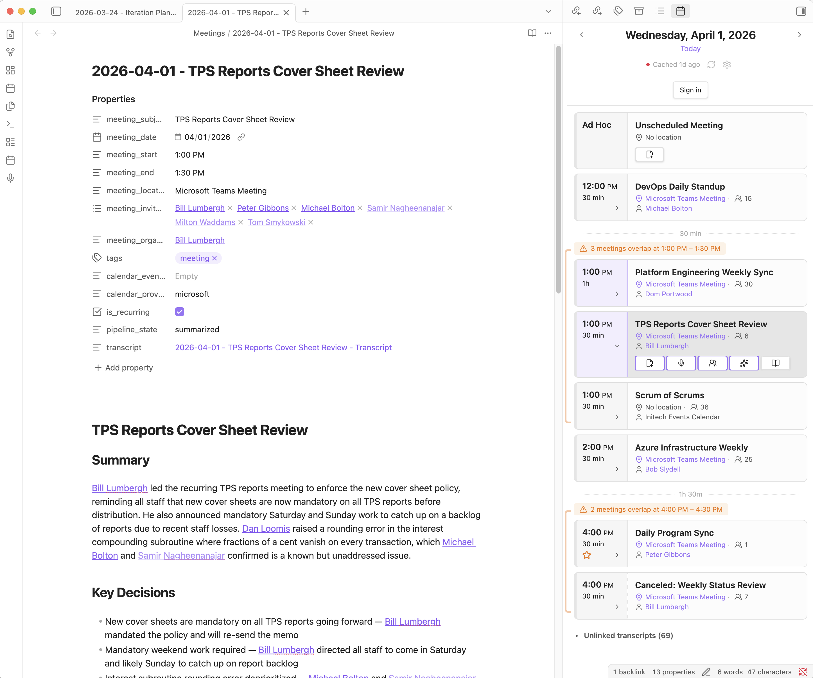

# WhisperCal

A desktop-only Obsidian plugin that puts your calendar in a sidebar (Microsoft 365 or Google Calendar), creates templated meeting notes with one click, records meetings and links transcripts to notes, and drives an LLM-powered pipeline to tag speakers, research context, and summarize meetings.

> **Desktop only.** WhisperCal uses Node APIs and AppleScript and will not load on Obsidian mobile.

**Speaker tagging modal with per-speaker transcript excerpts:**



<br>

**LLM-generated meeting summary with key decisions and action items:**



---

## Table of Contents

- [Features at a Glance](#features-at-a-glance)
- [Prerequisites](#prerequisites)
- [Installation](#installation)
- [Setup](#setup)
  - [Choosing a Calendar Provider](#choosing-a-calendar-provider)
  - [Microsoft 365 Setup](#microsoft-365-setup)
  - [Google Calendar Setup](#google-calendar-setup)
  - [Signing In](#signing-in)
  - [Cloud Instances (Microsoft)](#cloud-instances-microsoft)
- [The Calendar View](#the-calendar-view)
  - [Navigation](#navigation)
  - [Status Indicator](#status-indicator)
  - [Meeting Cards](#meeting-cards)
  - [Collapsible Cards](#collapsible-cards)
  - [All-Day Events](#all-day-events)
  - [Unscheduled Meetings](#unscheduled-meetings)
  - [Active Event Highlighting](#active-event-highlighting)
  - [Conflict Detection](#conflict-detection)
  - [Gap Markers](#gap-markers)
  - [Gutter Icons](#gutter-icons)
  - [Gutter Background Colors](#gutter-background-colors)
  - [Category Bar](#category-bar)
  - [Button Highlights](#button-highlights)
  - [Non-Accepted Meeting Indicator](#non-accepted-meeting-indicator)
  - [Incomplete Workflow Highlighting](#incomplete-workflow-highlighting)
  - [Note-Open Highlighting](#note-open-highlighting)
  - [Unlinked Recordings](#unlinked-recordings)
- [The Five-Stage Pipeline](#the-five-stage-pipeline)
  - [Stage 1 — Note](#stage-1--note)
  - [Stage 2 — Record / Transcript](#stage-2--record--transcript)
  - [Stage 3 — Speakers](#stage-3--speakers)
  - [Stage 4 — Summary](#stage-4--summary)
  - [Stage 5 — Research](#stage-5--research)
  - [Pipeline State Tracking](#pipeline-state-tracking)
- [Meeting Note Templates](#meeting-note-templates)
  - [Template Setup](#template-setup)
  - [Template Variables](#template-variables)
  - [Reserved Frontmatter Keys](#reserved-frontmatter-keys)
- [Recording Sources](#recording-sources)
  - [MacWhisper](#macwhisper)
  - [Recording API](#recording-api)
  - [Re-Recording](#re-recording)
- [People Matching](#people-matching)
  - [Auto-Created People Notes](#auto-created-people-notes)
- [LLM Integration](#llm-integration)
  - [Speaker Tagging](#speaker-tagging)
    - [Per-Speaker Transcript Excerpts](#per-speaker-transcript-excerpts)
    - [Required LLM Output Format](#required-llm-output-format)
    - [What Happens When You Apply](#what-happens-when-you-apply)
  - [Word Replacements](#word-replacements)
  - [Summarization](#summarization)
  - [Meeting Research](#meeting-research)
  - [Per-Prompt Model Selection](#per-prompt-model-selection)
  - [How Invocation Works](#how-invocation-works)
  - [Concurrency and Timeouts](#concurrency-and-timeouts)
  - [LLM Settings](#llm-settings)
- [Calendar Caching](#calendar-caching)
- [Commands](#commands)
- [Settings Reference](#settings-reference)
- [Disclosures](#disclosures)
- [Troubleshooting](#troubleshooting)
- [Migrating Legacy Notes](#migrating-legacy-notes)
- [License](#license)

---

## Features at a Glance

- **Calendar sidebar** — Browse your Microsoft 365 or Google Calendar day by day inside Obsidian, with automatic refresh, offline caching, and conflict detection.
- **One-click meeting notes** — Create a pre-filled note from any calendar event using a customizable template with wiki-linked attendees.
- **Dual recording sources** — Link [MacWhisper](https://goodsnooze.gumroad.com/l/macwhisper) recordings by timestamp match, or record directly via a REST-based Recording API with a live timer on the card.
- **Speaker tagging** — Run an LLM in the background to identify speakers, review proposals with per-speaker transcript excerpts, and approve names in an in-Obsidian modal.
- **Meeting summarization** — Run an LLM in the background to produce an executive summary, with a progress banner in the note editor.
- **Meeting research** — Select vault notes as context and run an LLM to generate pre-meeting research, independent of the transcript pipeline.
- **People matching** — Attendees and organizers are matched to notes in a People folder and rendered as `[[wiki links]]`. Unmatched organizers can be auto-created.
- **Per-prompt model selection** — Choose a different Claude model for each LLM prompt (speaker tagging, summarization, research).

---

## Prerequisites

- **Obsidian** 1.4.10 or later (desktop only)
- A **Microsoft 365** account with calendar access, or a **Google** account with Google Calendar
- For Microsoft: an **Azure AD app registration** (see [Microsoft 365 Setup](#microsoft-365-setup))
- For Google: a **Google Cloud Console OAuth credential** (see [Google Calendar Setup](#google-calendar-setup))
- **MacWhisper** or a **Recording API**-compatible app (optional — needed for transcript features; see [Recording Sources](#recording-sources))
- An **LLM CLI tool** (optional — needed for speaker tagging, summarization, and research; default: [Claude Code](https://docs.anthropic.com/en/docs/claude-code/overview) `claude` CLI)

---

## Installation

> **Note:** WhisperCal is not yet available in the Obsidian community plugin directory. Install using BRAT or manually from GitHub releases.

### Using BRAT (recommended)

1. Install the [BRAT](https://github.com/TfTHacker/obsidian42-brat) plugin from Community plugins.
2. Open **Settings > BRAT > Add Beta plugin**.
3. Enter `dloomis/whisper-cal` and click **Add Plugin**.
4. Enable **WhisperCal** in **Settings > Community plugins**.

BRAT automatically downloads new releases and keeps the plugin up to date.

### Manual Installation

1. Download `main.js`, `manifest.json`, and `styles.css` from the [latest release](https://github.com/dloomis/whisper-cal/releases/latest).
2. Create a folder at `<your-vault>/.obsidian/plugins/whisper-cal/`.
3. Copy the three files into that folder.
4. Open **Settings > Community plugins** and enable **WhisperCal**.

---

## Setup

### Choosing a Calendar Provider

WhisperCal supports two calendar providers. In **Settings > WhisperCal > Calendar**, select your provider from the **Calendar provider** dropdown:

- **Microsoft 365** — Connects via Microsoft Graph API using OAuth2 Authorization Code with PKCE.
- **Google Calendar** — Connects via Google Calendar API using OAuth2 Authorization Code with PKCE.

The rest of the settings UI adapts to show only the fields relevant to your chosen provider. You can switch providers at any time — each provider's auth tokens are stored separately, so switching back preserves your sign-in.

### Microsoft 365 Setup

WhisperCal connects to your calendar through the Microsoft Graph API. You need to register an app in Azure AD:

1. Go to the [Azure Portal](https://portal.azure.com) > **Azure Active Directory** > **App registrations** > **New registration**.
2. Set a name (e.g., "WhisperCal").
3. Under **Supported account types**, choose the option that matches your organization.
4. Under **Redirect URI**, select **Public client/native (mobile & desktop)** and set the URI to `http://localhost`.
5. Click **Register**.
6. On the app's **Overview** page, copy the **Application (client) ID**. The **Directory (tenant) ID** is optional — leave it empty to auto-detect from your account at sign-in.
7. Go to **API permissions** > **Add a permission** > **Microsoft Graph** > **Delegated permissions**.
8. Add **Calendars.Read** and **offline_access**.
9. Click **Grant admin consent** (if required by your organization).

Then in WhisperCal settings:
- Paste the **Client ID** into the corresponding field. **Tenant ID** is optional — leave it empty to auto-detect from your account at sign-in, or paste a specific tenant ID to restrict sign-in to one organization.
- Select your **Cloud instance** (most users should leave this on "Public").

### Google Calendar Setup

WhisperCal connects to Google Calendar through the Google Calendar API. You need to create OAuth credentials in the Google Cloud Console:

1. Go to the [Google Cloud Console](https://console.cloud.google.com/).
2. Create a new project (or select an existing one).
3. Navigate to **APIs & Services > Library** and enable the **Google Calendar API** and the **People API**.
4. Go to **APIs & Services > Credentials** > **Create credentials** > **OAuth client ID**.
5. Set the application type to **Desktop app** and give it a name (e.g., "WhisperCal").
6. Click **Create** and copy the **Client ID** and **Client secret**.
7. If your app will be used by more than 100 users, complete the [OAuth consent screen verification](https://support.google.com/cloud/answer/7454865). For personal use this is not required.

Then in WhisperCal settings:
- Paste the **Client ID** and **Client secret** into the corresponding fields under "Google account".

### Signing In

Both providers use an **OAuth2 Authorization Code flow with PKCE**. The experience is the same:

1. Click **Sign in** in the WhisperCal settings panel (or in the calendar sidebar's inline sign-in banner).
2. Your default browser opens to the provider's sign-in page.
3. Sign in and grant WhisperCal access to your calendar.
4. The browser redirects to a localhost page confirming success. You can close the tab and return to Obsidian.

If you don't complete sign-in within 5 minutes, the flow times out and you can try again.

For both providers, tokens are stored locally in the plugin's `data.json` file within your vault. Access tokens refresh automatically; you should rarely need to sign in again. To sign out, click **Sign out** in settings.

### Cloud Instances (Microsoft)

If your organization uses a government or sovereign cloud, select the appropriate instance in settings:

| Instance | Authority | Graph API | Who uses it |
|----------|-----------|-----------|-------------|
| **Public** | `login.microsoftonline.com` | `graph.microsoft.com` | Most organizations |
| **USGov** | `login.microsoftonline.com` | `graph.microsoft.com` | US Government (GCC) |
| **USGovHigh** | `login.microsoftonline.us` | `graph.microsoft.us` | US Government (GCC High) |
| **USGovDoD** | `login.microsoftonline.us` | `dod-graph.microsoft.us` | US Department of Defense |
| **China** | `login.chinacloudapi.cn` | `microsoftgraph.chinacloudapi.cn` | 21Vianet (China) |

You can also override the **Login URL** if your environment uses a non-standard endpoint.

---

## The Calendar View

Open the calendar sidebar by clicking the **calendar ribbon icon** or running the **"Open calendar view"** command.

### Navigation

- **Left / right chevron** — Move one day backward or forward.
- **Today button** — Jump to the current date (hidden when already viewing today).
- **Refresh button** — Manually refresh calendar data from your calendar provider.
- **Settings gear** — Opens WhisperCal settings directly from the calendar header.
- **Sign in** — When signed out, an inline banner appears at the top of the calendar with a sign-in button, so you don't need to visit settings to authenticate.

The calendar auto-refreshes on a configurable interval (default: every 5 minutes). At midnight, the view automatically advances to the new day.

### Status Indicator

A small dot below the header shows connection status:

- **Green dot** + "Updated X min ago" — Live data from your calendar provider.
- **Gray dot** + "Cached X min ago" — Showing previously fetched data (offline or between refreshes).
- **Gray dot** + "Offline" — No cached data available for this day.

### Meeting Cards

Each calendar event is displayed as a two-column card:

- **Time gutter** (left) — Start/end times, duration, "All day", or "Ad hoc" for unscheduled meetings. Below the time, an inline row of icons provides at-a-glance context (see [Gutter Icons](#gutter-icons)). A category color bar runs along the left edge. Shows a warning-colored background when the workflow is incomplete, and a dashed bar for meetings you haven't accepted.
- **Content** (right):
  - **Subject** — The meeting title.
  - **Organizer row** — Organizer name with People note link (if matched).
  - **Meta row** — Location (clickable for online meeting URLs), attendee count, and duration (e.g., "30m" or "1h 30m"), separated by middle dots.
  - **Workflow pills** — Note, Record/Transcript, Speakers, Summary, Research (see [The Five-Stage Pipeline](#the-five-stage-pipeline)).

Cards can be [collapsed](#collapsible-cards) to hide their action pills. All-day events (if enabled in settings) appear at the top, followed by timed events sorted by start time.

### Collapsible Cards

Each card has a **chevron toggle** in the gutter icon row. Click it to collapse or expand the card's action pills. Collapsed cards show only the subject, organizer, and metadata — useful for a compact view of a busy day. The expanded/collapsed state persists across calendar refreshes.

### All-Day Events

When **"Show all-day events"** is enabled in settings, all-day events appear at the top of the calendar as compact, read-only cards. They show the event subject and category color bar but have no action pills — they are informational only.

### Unscheduled Meetings

An "Unscheduled Meeting" card always appears at the top of the calendar view. Use it to create notes for ad-hoc meetings that aren't on your calendar. The subject is configurable in settings (default: "Unscheduled Meeting").

Unscheduled notes use the current timestamp as their meeting time and get a wider recording-matching window (720 minutes instead of the usual 15).

### Active Event Highlighting

When viewing today's calendar:
- **Currently ongoing events** (between start and end time) are highlighted.
- If no event is ongoing, the **next upcoming event** is highlighted instead.

### Conflict Detection

When multiple events overlap in time, they are grouped together and preceded by a banner showing the overlap window (e.g., "3 meetings overlap at 2:30 PM – 3:00 PM"). This makes scheduling conflicts immediately visible.

### Gap Markers

Between non-overlapping event groups, a gap indicator shows how much free time you have (e.g., "45m" or "1h 15m").

### Gutter Icons

Below the time and duration, the gutter displays up to three inline icons (in this order):

| Icon | Meaning |
|------|---------|
| **☆ Star** | You are the organizer of this meeting. Determined by comparing the event's organizer email against your calendar account email. |
| **⛔ Octagon-alert** | The organizer is in your **important organizers** list (configured in settings with people autocomplete from your calendar provider). |
| **⊞ Grid-2x2** | The meeting has a **category** assigned (Outlook categories for Microsoft, color labels for Google). The icon color matches the category color. Hover for the category name tooltip. |

### Gutter Background Colors

The gutter background tint reflects the pipeline workflow state:

| Color | Meaning |
|-------|---------|
| **No tint** (default) | No meeting note created yet, or pipeline not started. |
| **Warning tint** (amber/yellow, `--text-warning`) | Meeting note exists but the pipeline is incomplete — recording, speaker tagging, or summarization still needed. |
| **Accent tint** (your theme accent color, `--interactive-accent`) | All four pipeline stages are complete. |

### Category Bar

The vertical bar on the left edge of the card indicates the event category color (Outlook categories for Microsoft, color labels for Google). When no category is assigned, it uses a subtle default. When the gutter has a workflow tint, the bar darkens to a deeper shade of the same workflow color, keeping it visually distinct from the background.

### Button Highlights

The four pipeline pill buttons show their completion state via border color:

| State | Appearance |
|-------|------------|
| **Default** | Neutral border, theme icon color. |
| **Complete** | Accent-colored border and glow (`--interactive-accent`). |
| **Hover** | Accent-tinted background and border. |
| **Running** | Pulsing accent background, disabled. |

### Non-Accepted Meeting Indicator

Meetings you haven't accepted (tentative, not responded, or declined) show a **dashed category bar** on the time gutter, alternating between the category color and the primary background color, making them visually distinct from accepted meetings.

### Incomplete Workflow Highlighting

Cards that have a meeting note but haven't completed the full pipeline (through summarization) show a **warning-tinted gutter** with a darkened category bar. This provides a visual cue that there is still work to do — whether that's linking a recording, tagging speakers, or running summarization. The tint disappears once the Summary stage is complete, replaced by the accent highlight.

### Note-Open Highlighting

When you open a meeting note in any editor tab, the corresponding card in the calendar sidebar is highlighted and scrolled into view. If the note belongs to a different day, the calendar automatically navigates to that day.

### Unlinked Recordings

A collapsible **"Unlinked recordings"** section appears at the bottom of the calendar view when there are recordings that haven't been linked to any note in your vault. This helps you catch recordings you forgot to process. The source depends on your recording setting — MacWhisper sessions or Recording API transcript files.

**How it works:**
- **MacWhisper:** Scans the MacWhisper database for sessions within a configurable lookback window (default: 30 days). Skips recent recordings within a grace period (default: 48 hours).
- **Recording API:** Scans the transcripts folder for transcript files not linked to any meeting note.
- Cross-references against vault notes. Any recording not found linked to a note is shown as unlinked.

**Linking an unlinked recording:**
1. Click the **Link** button on an unlinked recording card. A **View** button also lets you open the transcript directly.
2. WhisperCal checks the calendar cache for events near the recording's start time (using the same recording match window).
3. If matching calendar events are found, a picker shows them along with a **"Create unscheduled note"** fallback. Events whose notes already have a recording linked are filtered out.
4. If no matches are found, an unscheduled note is created directly, dated to the recording's actual start time.
5. The recording is linked and a transcript is generated, just like the normal flow.

The section is collapsed by default and only appears when the count is greater than zero.

---

## The Five-Stage Pipeline

Each meeting card has up to five **pill buttons** that track your progress through the meeting workflow. Pills are filled with a checkmark when complete, outlined when ready to act on, and grayed out when their prerequisites aren't met.

```
Note  -->  Record/Transcript  -->  Speakers  -->  Summary
                                                     Research (independent)
```

### Stage 1 — Note

**Click the "Note" pill** to create a meeting note from the calendar event.

- A new Markdown file is created in your configured notes folder using your template.
- The filename follows your configured pattern (default: `YYYY-MM-DD - Subject.md`).
- Frontmatter is populated with meeting metadata (subject, date, time, location, attendees, etc.).
- Attendees are matched against your People folder and rendered as `[[wiki links]]`.
- The organizer is shown with a People note link if matched.
- The note opens in a new tab with the cursor placed after the `# Notes` heading.

Once the note exists, clicking the pill opens it.

### Stage 2 — Record / Transcript

The second pill adapts based on your configured [recording source](#recording-sources):

**MacWhisper mode** — The pill is labeled "Transcript". Click it to link an existing MacWhisper recording:
- A picker modal shows MacWhisper recordings that started near the meeting time.
- Select a recording, and WhisperCal writes the session ID to frontmatter, sets the recording title in MacWhisper, waits for transcription, creates a transcript file, and links everything together.

**Recording API mode** — The pill is labeled "Record". Click it to start a live recording:
- The recording starts via the configured API, and a **live elapsed timer** appears on the card with a pulsing red dot.
- Click again to stop the recording. WhisperCal polls for transcription completion, then links the transcript file to the meeting note.

Once the transcript exists, clicking the pill opens it.

### Stage 3 — Speakers

**Click the "Speakers" pill** to run LLM speaker tagging in the background.

- The LLM reads your speaker tagging prompt and the transcript, then outputs proposed speaker identities.
- A **confirmation modal** appears inside Obsidian showing each speaker with the LLM's proposed name, confidence level, evidence, and [transcript excerpts](#per-speaker-transcript-excerpts).
- Review the proposals, edit names as needed, and click **Apply** to commit.
- WhisperCal replaces speaker labels throughout the transcript and sets `pipeline_state: tagged`.

The pill shows a spinning indicator while the LLM is running. Once speakers are tagged, clicking the pill opens the transcript.

### Stage 4 — Summary

**Click the "Summary" pill** to run LLM summarization in the background.

- A "Summarizing…" banner appears at the top of the meeting note editor.
- The LLM reads your summarizer prompt along with the meeting note and transcript, then writes the summary.
- When finished, the LLM sets `pipeline_state: summarized` and the banner disappears.

Once the summary is complete, clicking the pill opens the meeting note.

### Stage 5 — Research

**Click the "Research" pill** to run LLM-powered meeting research. This stage is **independent** of the transcript pipeline — you can run it anytime after creating a meeting note, even before a recording exists.

- A modal lets you **search and select vault notes** as context (project plans, policies, prior meeting notes, etc.).
- Add optional instructions or override the prompt entirely with a custom one.
- The LLM reads your research prompt along with the selected notes and meeting context, then writes its findings into the meeting note.
- When complete, `research_notes` is added to the meeting note's frontmatter and the Research pill fills in.

This is useful for pre-meeting preparation or post-meeting fact-checking against organizational documents.

### Pipeline State Tracking

Pipeline state is stored in frontmatter as `pipeline_state` with these values:

| Value | Meaning |
|-------|---------|
| `titled` | Transcript created, ready for speaker tagging |
| `tagged` | Speakers identified, ready for summarization |
| `summarized` | Summary complete, pipeline finished |

The state lives on the **transcript file** as its source of truth. WhisperCal automatically **mirrors** it to the meeting note's frontmatter whenever the transcript changes, so both files stay in sync.

---

## Meeting Note Templates

### Template Setup

WhisperCal uses a template file to control the **body content** of meeting notes. All frontmatter is auto-injected by the plugin from calendar data — you never need to put frontmatter keys in your template.

1. Copy `samples/WhisperCal Meeting Template.md` from the plugin's GitHub repo into your vault (e.g., `Templates/WhisperCal Meeting.md`).
2. Edit the body to your liking.
3. Set the **"Note template"** path in WhisperCal settings.

If no template is configured, WhisperCal shows a notice and won't create notes.

### Template Variables

Use `{{variableName}}` placeholders in your template body. All available variables:

| Variable | Description | Example |
|----------|-------------|---------|
| `{{subject}}` | Meeting subject | `Weekly Standup` |
| `{{date}}` | Meeting date | `2026-03-07` |
| `{{startTime}}` | Start time | `10:00 AM` |
| `{{endTime}}` | End time | `10:30 AM` |
| `{{location}}` | Location or "N/A" | `Conference Room B` |
| `{{organizer}}` | Organizer as wiki link (if matched) or plain name | `[[Jane Smith]]` |
| `{{organizerName}}` | Organizer display name | `Jane Smith` |
| `{{organizerEmail}}` | Organizer email address | `jane@example.com` |
| `{{attendeeCount}}` | Number of attendees | `5` |
| `{{attendees}}` | Comma-separated wiki links | `"[[Jane Smith]]", "[[Bob Lee]]"` |
| `{{attendeeList}}` | Bullet list of wiki links | `- [[Jane Smith]]` (one per line) |
| `{{isOnlineMeeting}}` | Whether it has an online link | `true` |
| `{{onlineMeetingUrl}}` | Online meeting join URL (Teams, Google Meet, Zoom, etc.) | `https://teams.microsoft.com/...` |
| `{{isAllDay}}` | All-day event flag | `false` |
| `{{description}}` | Event body (HTML converted to Markdown) | Meeting agenda text |

### Reserved Frontmatter Keys

The following keys are **auto-injected** by the plugin when creating a note. Do not add them to your template — they are managed programmatically:

| Key | Purpose |
|-----|---------|
| `meeting_subject` | Display title in the calendar view; passed to transcript |
| `meeting_date` | Calendar navigation and recording time matching |
| `meeting_start` | Recording time matching |
| `meeting_end` | Meeting end time |
| `meeting_location` | Meeting location |
| `meeting_invitees` | Attendee list; passed to transcript creation |
| `meeting_organizer` | Meeting organizer as wiki link |
| `tags` | Used to distinguish meeting notes from transcript files |
| `calendar_event_id` | Identifies this file as a WhisperCal meeting note |
| `note_created` | Fallback timestamp for unscheduled notes |
| `is_recurring` | Passed to transcript creation |
| `macwhisper_session_id` | Links a MacWhisper recording to the note |
| `transcript` | Backlink to the transcript file |
| `pipeline_state` | Workflow state; mirrored from transcript automatically |

---

## Recording Sources

WhisperCal supports two recording sources, configurable in **Settings > WhisperCal > Recording > Source**:

### MacWhisper

The default source. WhisperCal reads directly from [MacWhisper](https://goodsnooze.gumroad.com/l/macwhisper)'s local SQLite database to match recordings to meetings and extract transcripts. It does not modify your audio files.

**Requirements:**
- MacWhisper must be installed (database path: `~/Library/Application Support/MacWhisper/Database/main.sqlite`).
- Recordings must be transcribed in MacWhisper before a transcript file can be created. WhisperCal will wait up to ~3 minutes for transcription to complete.

A **microphone ribbon icon** is provided to quickly launch MacWhisper.

**How recording matching works:** When you click the Transcript pill, WhisperCal queries the MacWhisper database for sessions whose recording start time falls within a configurable window of the meeting's scheduled start time.

- **Default window:** 15 minutes before or after the meeting start.
- **Unscheduled meetings:** 720-minute window (12 hours).
- **Recording start time** is determined from the filesystem birthtime of the track-0 audio file, which is more accurate than MacWhisper's database timestamps.

If multiple recordings match, a picker modal lets you choose. The picker shows the recording title, date, time, and duration for each match.

**Transcript file format:** Transcript files are created in your configured transcripts folder with the naming pattern `<Note Name> - Transcript.md`. They contain:

- **Frontmatter:** Recording date, `tags: [transcript]`, `macwhisper_session_id`, duration, `meeting_note` backlink, speaker metadata, meeting context fields, and `pipeline_state: titled`.
- **Body:** AI Summary (if MacWhisper generated one) as a blockquote, followed by the Full Transcript section. Diarized recordings show speaker-grouped lines with timestamps (`**Jane Smith** [00:01:23]`); non-diarized recordings show timestamped lines without speaker labels.

**Linking flow:** Match → Select → Title → Link session ID to frontmatter → Wait for transcription → Create transcript file → Backlink to meeting note.

### Recording API

An alternative source that records meetings directly via a REST API (compatible with apps like [Tome](https://tome.app)). The Record pill on meeting cards starts and stops recordings without leaving Obsidian.

**Requirements:**
- A recording application running a compatible REST API on localhost.
- The API must implement: `GET /health`, `POST /start`, `POST /stop`, `GET /status`.

**API auto-discovery:** If the **Recording API base URL** is left empty in settings, WhisperCal looks for the Tome port file at `~/Library/Application Support/Tome/api-port` and constructs the URL automatically.

**Recording flow:**
1. Click the Record pill — WhisperCal checks the API health, then sends a start request with the meeting subject and attendees.
2. A **pulsing red dot** and **live elapsed timer** appear on the card while recording.
3. Click again to stop — WhisperCal polls `/status` every 3 seconds until transcription is complete (up to 5 minutes).
4. The transcript file is located in the vault's transcripts folder, enriched with pipeline frontmatter (meeting subject, invitees, date, organizer, location), and linked to the meeting note.

### Re-Recording

If a meeting already has a linked transcript, clicking the Record/Transcript pill shows a confirmation modal with options to **View** the existing transcript or **Re-record**. Re-recording clears the transcript link, pipeline state, and any speaker tags or summary.

---

## People Matching

WhisperCal can match meeting attendees to notes in a **People folder** in your vault, rendering them as `[[wiki links]]` in meeting notes and providing context for LLM prompts.

### Setup

1. Create a folder in your vault for people notes (e.g., `People/`).
2. Set the **"People folder"** path in WhisperCal settings.
3. Each person note should have frontmatter with identifying information.

### Matching Fields

WhisperCal matches attendees by checking these frontmatter fields in People notes:

**Email fields** (matched against the attendee's email address, case-insensitive):
- `company_email`
- `personal_email`
- `sipr_email`
- `nipr_email`
- `preferred_email`

**Name field** (matched against the attendee's display name, case-insensitive):
- `full_name`

Email matching is tried first; if no email match is found, name matching is attempted. Matched attendees appear as `[[Note Name]]` wiki links in the template output. Unmatched attendees appear as plain text names.

### Auto-Created People Notes

WhisperCal can automatically create People notes for meeting organizers who don't have a matching note in your vault. When the calendar view refreshes, it scans organizers and silently creates notes for ones that look like real people (filtering out team calendars, room resources, and system accounts).

Auto-created notes include frontmatter with `full_name`, `nickname`, organization (derived from email domain), and personnel type. A Dataview query is included to show related meetings.

### Example People Note

```markdown
---
full_name: Jane Smith
company_email: jane.smith@example.com
---

# Jane Smith

Role: Engineering Manager
```

---

## LLM Integration

WhisperCal invokes an external LLM CLI tool as a background process to tag speakers in transcripts, summarize meetings, and run meeting research. The LLM runs headlessly inside Obsidian — no terminal window is required. Progress and errors are reported via Obsidian notices.

**Enable LLM features:** LLM features are disabled by default. Toggle **"Enable LLM features"** in settings. On first enable, a consent modal explains that transcripts and note content may be sent to a cloud LLM provider, and asks you to confirm.

**Included prompts:** The plugin ships with three ready-to-use prompt files in the `samples/` directory — speaker tagging, summarization, and meeting research. These are designed to work out of the box as defaults. You can use them as-is or copy them into your vault and customize them to fit your workflow.

### Speaker Tagging

**Prerequisite:** A transcript file must exist (Stage 2 complete, `pipeline_state: titled`).

**Setup:**

1. Copy `samples/Speaker Auto-Tag Prompt.md` from the plugin's GitHub repo into your vault (e.g., `Prompts/Speaker Tagging.md`). This prompt works as a ready-to-use default — customize it if needed.
2. Set the **"Speaker tagging prompt"** path in WhisperCal settings.
3. Set the **"Microphone user"** field to your full name as it appears in meetings.

**Usage:**

1. Click the **Speakers pill** on a meeting card, or run the **"Tag speakers in transcript"** command.
2. The pill shows a spinning indicator while the LLM runs in the background.
3. When the LLM finishes, a **speaker confirmation modal** appears inside Obsidian.
4. Review the proposed mappings, edit any names, and click **Apply**.
5. WhisperCal replaces speaker labels in the transcript body and sets `pipeline_state: tagged`.

**The confirmation modal** shows each speaker from the transcript with:
- The **original stub name** (e.g., "Speaker 1") and how many transcript lines they have.
- The **proposed real name** pre-filled from the LLM output (editable).
- A **confidence badge** (CERTAIN, HIGH, or LOW) and the LLM's evidence for its guess.
- Speakers are sorted by confidence (highest first) so you can quickly approve high-confidence matches and focus attention on uncertain ones.

You can clear a name field to leave that speaker untagged, or type a different name. Click **Cancel** to discard all changes.

#### Per-Speaker Transcript Excerpts

Each speaker row in the confirmation modal has an expandable **excerpt panel**. Click the chevron toggle next to a speaker to see their actual transcript lines — timestamps and spoken text. This lets you hear each speaker's "voice" in context, making it easier to confirm or correct the LLM's identification without leaving the modal.

#### Required LLM Output Format

The plugin injects the expected output format into the LLM's trigger string at invocation time — your prompt file does not need to specify the format. The LLM's **stdout** must contain a fenced JSON code block with a `speakers` array:

````
```json
{
  "speakers": [
    {
      "index": 0,
      "original_name": "Microphone",
      "proposed_name": "Jane Smith",
      "confidence": "CERTAIN",
      "evidence": "microphone user"
    },
    {
      "index": 1,
      "original_name": "Speaker 1",
      "proposed_name": "Bob Lee",
      "confidence": "HIGH",
      "evidence": "introduced himself at 00:02:15"
    },
    {
      "index": 2,
      "original_name": "Speaker 2",
      "proposed_name": null,
      "confidence": null,
      "evidence": "no matching attendee"
    }
  ]
}
```
````

| Field | Description |
|-------|-------------|
| `index` | Zero-based index matching the order of speakers in the transcript's frontmatter `speakers` array. `0` = Microphone, `N` = Speaker N. |
| `original_name` | The stub name from the transcript (e.g., "Microphone", "Speaker 1"). Must match the frontmatter speaker name exactly. |
| `proposed_name` | The real name the LLM believes this speaker is. Use `null` if the LLM cannot determine the identity. |
| `confidence` | One of `"CERTAIN"`, `"HIGH"`, or `"LOW"`. Use `null` for unresolved speakers. |
| `evidence` | Free-text explanation of why the LLM made this identification (e.g., "microphone user", "introduced themselves at 00:05:12"). |

**Important notes:**
- The parser extracts the first fenced `` ```json `` block from the LLM's stdout. Everything outside the block is ignored, so the LLM can include reasoning or other output around it.
- If no JSON block is found, the parser falls back to the legacy `Proposed Mapping:` text format for backward compatibility.
- If parsing fails entirely or the LLM returns empty output, WhisperCal falls back to showing the transcript's frontmatter speakers without AI suggestions. The user can still manually type names in the modal.

#### What Happens When You Apply

When you click **Apply** in the modal, WhisperCal:

1. Updates each speaker entry in the transcript's frontmatter `speakers` array — sets `name` to the confirmed name, saves the original as `original_name`, and records `confidence` and `evidence`.
2. Adds a `confirmed_speakers` frontmatter key with wiki links to all confirmed names (e.g., `["[[Jane Smith]]", "[[Bob Lee]]"]`).
3. Sets `pipeline_state: tagged` in the transcript frontmatter (and mirrors it to the meeting note).
4. Replaces all occurrences of `**Original Name**` with `**Confirmed Name**` in the transcript body text.
5. Applies word replacements from the configured replacement file (see [Word Replacements](#word-replacements) below).

### Word Replacements

WhisperCal can fix common transcription errors automatically using a word replacement file — a simple list of search/replace pairs, one per line.

**Setup:**

1. Create a markdown file in your vault (default path: `Prompts/Word Replacements.md`).
2. Add one replacement per line in `search,replace` format. Lines starting with `#` are comments.

```
# Fix common transcription errors
Nipper,NIPR
Kariosoft,Carahsoft
Shine Mountain,Cheyenne Mountain
```

3. Set the **"Word replacement file"** path in WhisperCal settings, or use the default. Click **Open** next to the setting to create and edit the file.

**How it works:**

- Replacements are case-sensitive and use word boundaries to avoid partial matches (e.g., `ash` → `ASH` won't affect "crash").
- Longer search terms are matched first, so `Shine Mountain` matches before `Shine` would.
- Frontmatter is preserved — only the note body is modified.
- All word-bounded terms are combined into a single regex pass for efficiency, even with 100+ rules.

**When replacements run:**

- **Automatically** after speaker tagging — when you click Apply in the speaker tag modal, word replacements run on the transcript immediately after speaker names are applied.
- **Manually on any note** — use the replace-all icon (⇄) in the note toolbar or the **"Run word replacements"** command from the command palette. A confirmation modal lets you review the replacement list before running.

### Summarization

**Prerequisite:** Speakers must be tagged (Stage 3 complete, `pipeline_state: tagged`).

**Setup:**

1. Copy `samples/Meeting Transcript Summarizer Prompt.md` from the plugin's GitHub repo into your vault (e.g., `Prompts/Meeting Summarizer.md`). This prompt works as a ready-to-use default — customize it if needed.
2. Set the **"Summarizer prompt"** path in WhisperCal settings.

**Usage:**

1. Click the **Summary pill** on a meeting card, or run the **"Summarize meeting transcript"** command.
2. A "Summarizing…" banner appears at the top of the meeting note while the LLM runs.
3. When complete, the LLM should write its summary into the meeting note and set `pipeline_state: summarized`.
4. The banner disappears and the Summary pill fills in.

The summarizer prompt receives the meeting note path as its target. Your prompt should instruct the LLM to read the linked transcript (available via the `transcript` frontmatter key) and write the summary into the meeting note.

**Auto-summarize:** If **"Auto-summarize after tagging"** is enabled in settings, summarization starts automatically as soon as you apply speaker tags — no need to click the Summary pill. The timeout applies independently to each stage, so a 5-minute timeout gives speaker tagging 5 minutes and summarization another 5 minutes.

### Meeting Research

**Prerequisite:** A meeting note must exist (Stage 1 complete). No transcript is required — research can run before, during, or after a meeting.

**Setup:**

1. Copy `samples/Meeting Research Prompt.md` from the plugin's GitHub repo into your vault (e.g., `Prompts/Meeting Research Prompt.md`). This prompt works as a ready-to-use default — customize it if needed.
2. Set the **"Research prompt"** path in WhisperCal settings.

**Usage:**

1. Click the **Research pill** on a meeting card, or run the **"Research meeting"** command.
2. A modal opens where you can:
   - **Search and select vault notes** to include as context (project plans, policies, prior notes, etc.).
   - **Add custom instructions** for the LLM.
   - **Bypass the prompt file** entirely by checking "Use as direct prompt" and writing a custom prompt in the text area.
3. Click **Research** to run the LLM in the background.
4. When complete, the research output is written into the meeting note and `research_notes` is set in frontmatter.

### Per-Prompt Model Selection

Each LLM prompt (Speaker Tagging, Summarizer, Research) has its own **model selector** dropdown. This lets you use a more capable model for summarization while using a faster model for speaker tagging, for example.

Model options are populated from the Anthropic API if the `ANTHROPIC_API_KEY` environment variable is set. If no API key is available, only "Default" (whatever the CLI tool defaults to) is shown.

### How Invocation Works

WhisperCal spawns the LLM CLI as a child process using your login shell (so your PATH includes tools installed via Homebrew, nvm, etc.). The process runs in the background with no terminal window. The working directory is set to your vault root.

The LLM receives a single prompt string constructed from:

- The path to your prompt file: `Follow the instructions in '<prompt-path>'.`
- The target file: `Transcript: <path>.` (speaker tagging) or `Meeting note: <path>.` (summarization)
- Optional context: `Microphone user: <name>.`, `Transcripts Folder: <folder>.`, `People Folder: <folder>.`
- For speaker tagging: an output format instruction specifying the expected JSON schema (the plugin hardcodes this — your prompt does not need to define it)

**Pre-flight checks:** Before spawning the LLM, WhisperCal validates that:
- The CLI command exists on your PATH.
- The prompt file exists on disk.
- The concurrency limit hasn't been reached.

If any check fails, an Obsidian notice explains the problem.

### Concurrency and Timeouts

- **Concurrency limit** — A maximum number of LLM processes can run simultaneously (default: 2). If you try to start another job while at the limit, a notice tells you to wait. This prevents overloading your machine or hitting API rate limits.
- **Timeout** — Each LLM process is killed if it runs longer than the configured timeout (default: 5 minutes). The process receives SIGTERM, then SIGKILL after 5 seconds if it doesn't exit. A timed-out job shows a notice with the duration.
- **Plugin unload** — When you disable the plugin or quit Obsidian, all running LLM processes are terminated (SIGTERM) and job tracking is cleared.

### LLM Settings

| Setting | Default | Description |
|---------|---------|-------------|
| **Enable LLM features** | Off | Master toggle for all LLM functionality. Shows a consent modal on first enable. |
| **CLI command** | `claude` | The LLM CLI executable name or path. Must be on your shell's PATH. |
| **Additional flags** | `--dangerously-skip-permissions` | Extra CLI flags appended to every LLM invocation. The default flag allows Claude Code to read/write files without interactive prompts, which is required since the LLM runs headlessly with no terminal. Adjust this for your CLI tool — most LLMs need a similar non-interactive or auto-approve flag to work in the background. |
| **Microphone user** | *(empty)* | Your full name as it appears in meetings. Passed to the LLM to help identify your voice. |
| **Speaker tagging prompt** | `Prompts/Speaker Auto-Tag Prompt.md` | Path to your speaker tagging prompt file (vault-relative, absolute, or `~/`-relative). |
| **Speaker tagging model** | *(default)* | Claude model to use for speaker tagging. |
| **Summarizer prompt** | `Prompts/Meeting Transcript Summarizer Prompt.md` | Path to your summarization prompt file. |
| **Summarizer model** | *(default)* | Claude model to use for summarization. |
| **Research prompt** | `Prompts/Meeting Research Prompt.md` | Path to your meeting research prompt file. |
| **Research model** | *(default)* | Claude model to use for meeting research. |
| **LLM timeout (minutes)** | `5` | Kill the LLM process if it runs longer than this. Set to `0` to disable the timeout. |
| **Max concurrent LLM processes** | `2` | Maximum number of LLM processes that can run at the same time. |
| **Auto-summarize after tagging** | Off | Automatically start summarization after speaker tagging completes. Requires a summarizer prompt to be configured. |
| **Debug mode** | Off | Opens LLM commands in a Terminal window instead of running in the background. Useful for seeing raw command output. |

---

## Calendar Caching

WhisperCal maintains a local cache of calendar data so you can browse your schedule offline.

**Behavior:**
- **Past days** are served from cache and never re-fetched (they won't change).
- **Today and future days** are fetched live when possible, with cache as a fallback if offline.
- **Pre-fetching** — After a successful fetch of today's events, the next N days are pre-fetched in the background (configurable, default: 5 days).
- **Retention** — Cached days older than the retention period are pruned automatically (configurable, default: 30 days).

---

## Commands

All commands are available from the command palette (`Cmd+P`):

| Command | Description |
|---------|-------------|
| **Open calendar view** | Opens the WhisperCal calendar sidebar |
| **Link MacWhisper recording** | Links a MacWhisper recording to the active meeting note (only available when a meeting note is open) |
| **Tag speakers in transcript** | Launches LLM speaker tagging for the active note's transcript (available on meeting notes with a transcript, or directly on transcript files) |
| **Summarize meeting transcript** | Launches LLM summarization (available when `pipeline_state` is `tagged`) |
| **Research meeting** | Opens the research modal to run LLM-powered meeting research with selected vault notes as context (available on meeting notes) |
| **Run word replacements** | Applies word replacement rules to the active note (available on any open note; also accessible via the ⇄ toolbar icon) |

**Link MacWhisper recording** is also available in the file context menu (right-click) for meeting notes.

**Ribbon icons:**
- **Calendar icon** — Opens the calendar view.
- **Microphone icon** — Launches the MacWhisper app.

**Note toolbar icon:**
- **Replace-all icon (⇄)** — Runs word replacements on the active note (appears on every markdown note).

---

## Settings Reference

### Notes

| Setting | Default | Description |
|---------|---------|-------------|
| **People folder** | *(empty)* | Vault folder containing people notes. Matched attendees render as `[[wiki links]]`. |
| **Notes folder** | `Meetings` | Where meeting notes are created. |
| **Transcripts folder** | `Transcripts` | Where transcript files are created. |
| **Note filename template** | `{{date}} - {{subject}}` | Filename pattern. Available variables: `{{date}}`, `{{subject}}`. |
| **Unscheduled note subject** | `Unscheduled Meeting` | Subject line for ad-hoc meeting notes. |
| **Note template** | *(empty)* | Path to a template file for meeting note body content. Copy the sample from the plugin's `samples/` folder to get started. |

### Recording

| Setting | Default | Description |
|---------|---------|-------------|
| **Source** | MacWhisper | Recording source: MacWhisper (link existing recordings) or Recording API (record directly). |
| **Database path** | *(read-only)* | Shows the MacWhisper database location (MacWhisper source only). |
| **Recording match window** | `15` min | How close a recording start must be to the meeting time to appear in the picker (MacWhisper source only). |
| **Unlinked lookback** | `30` days | How far back to check for unlinked recordings (MacWhisper source only). |
| **Recording API base URL** | *(empty = auto)* | REST API base URL. Leave empty to auto-detect from Tome's port file (Recording API source only). |

### LLM

| Setting | Default | Description |
|---------|---------|-------------|
| **Enable LLM features** | Off | Master toggle. Shows a consent modal on first enable. |
| **CLI command** | `claude` | LLM CLI executable name or path. |
| **Additional flags** | `--dangerously-skip-permissions` | Extra CLI flags appended to every LLM invocation. Must include a non-interactive flag for your CLI tool (see [LLM Settings](#llm-settings)). |
| **Microphone user** | *(empty)* | Your full name, passed to the LLM to identify your voice. |
| **Speaker tagging prompt** | `Prompts/Speaker Auto-Tag Prompt.md` | Path to your speaker tagging prompt file. |
| **Speaker tagging model** | *(default)* | Claude model for speaker tagging. |
| **Summarizer prompt** | `Prompts/Meeting Transcript Summarizer Prompt.md` | Path to your summarization prompt file. |
| **Summarizer model** | *(default)* | Claude model for summarization. |
| **Research prompt** | `Prompts/Meeting Research Prompt.md` | Path to your research prompt file. |
| **Research model** | *(default)* | Claude model for meeting research. |
| **LLM timeout** | `5` min | Kill the LLM process after this duration (0 = no timeout). |
| **Max concurrent** | `2` | Maximum simultaneous LLM processes. |
| **Word replacement file** | `Prompts/Word Replacements.md` | Path to a file of search/replace pairs applied to transcripts after speaker tagging (one per line: `search,replace`). Click **Open** to create and edit. |
| **Auto-summarize after tagging** | Off | Automatically start summarization when speaker tagging completes. |
| **Debug mode** | Off | Open LLM commands in Terminal instead of background. |

### Calendar

| Setting | Default | Description |
|---------|---------|-------------|
| **Calendar provider** | Microsoft 365 | Which calendar service to connect to (Microsoft 365 or Google Calendar). |
| **Timezone** | *(system locale)* | IANA timezone for displaying meeting times. Defaults to your system's timezone. |
| **Time format** | Auto | 12-hour, 24-hour, or auto-detect from system locale. |
| **Refresh interval** | `5` min | Auto-refresh frequency for the calendar view. |
| **Show all-day events** | Off | Display all-day events in the calendar view. |
| **Important organizers** | *(empty)* | Organizers whose meetings show an alert icon in the gutter. Autocomplete from your calendar provider. |
| **Cache future days** | `5` | Number of upcoming days to pre-fetch. |
| **Cache retention** | `30` days | How long past calendar data is kept locally. |

### Microsoft Account

Shown when Calendar provider is set to "Microsoft 365".

| Setting | Default | Description |
|---------|---------|-------------|
| **Tenant ID** | *(empty)* | Directory (tenant) ID from your Azure AD app registration. Leave empty to auto-detect from your account at sign-in. |
| **Client ID** | *(empty)* | Application (client) ID from your Azure AD app registration. |
| **Cloud instance** | Public | Microsoft cloud environment. |

### Google Account

Shown when Calendar provider is set to "Google Calendar".

| Setting | Default | Description |
|---------|---------|-------------|
| **Client ID** | *(empty)* | OAuth client ID from your Google Cloud Console desktop app credentials. |
| **Client secret** | *(empty)* | OAuth client secret from your Google Cloud Console desktop app credentials. |

---

## Disclosures

- **Remote services:** This plugin connects to the **Microsoft Graph API** or the **Google Calendar API** (depending on your chosen provider) to fetch calendar events. Both providers use OAuth 2.0 Authorization Code flow with PKCE via a localhost redirect. OAuth tokens for both providers are stored locally in the plugin's `data.json` file within your vault.
- **External file access:** The MacWhisper integration reads and writes to the MacWhisper SQLite database at `~/Library/Application Support/MacWhisper/Database/`. This is required to match recordings and extract transcripts. No data leaves your machine during this process.
- **Recording API:** When using the Recording API source, WhisperCal communicates with a localhost REST API to start/stop recordings and poll transcription status. All communication is local.
- **LLM invocation:** When you use the speaker tagging, summarization, or research features, WhisperCal spawns an external CLI tool (default: `claude`) as a background process. Your transcript and meeting note content are passed to that tool. The LLM process runs locally but may send data to a remote API depending on the CLI tool's configuration. Review your LLM provider's privacy policy to understand how your data is handled.
- **LLM model discovery:** If the `ANTHROPIC_API_KEY` environment variable is set, WhisperCal fetches available Claude models from the Anthropic API to populate per-prompt model selectors. No other data is sent.
- **Desktop only:** This plugin uses Node.js APIs (`child_process`, `os`) and AppleScript, and is not available on Obsidian Mobile.

---

## Troubleshooting

### "Client ID is required" (Microsoft)
The Client ID must be filled in before you can sign in. Tenant ID is optional. See [Microsoft 365 Setup](#microsoft-365-setup).

### "Client ID and Client secret are required" (Google)
Both fields must be filled in before you can sign in. See [Google Calendar Setup](#google-calendar-setup).

### Sign-in timed out
The sign-in flow is valid for 5 minutes. If it times out before you complete sign-in in the browser, click **Sign in** again.

### Calendar shows "Offline" with no events
- Check that you're signed in (Settings > WhisperCal > Microsoft Account section should show "Signed in").
- Try clicking the refresh button in the calendar header.
- Verify your Azure AD app has the **Calendars.Read** permission.

### No MacWhisper recordings found
- Ensure MacWhisper is installed and has recordings in its database.
- Check that the recording happened within the match window (default: 15 minutes of the meeting start time). You can increase this in settings.
- MacWhisper must have completed transcription before a transcript file can be created.

### LLM job fails immediately
- Verify the **CLI command** setting matches an installed CLI tool (e.g., `claude`). WhisperCal checks your login shell's PATH, so tools installed via Homebrew or nvm should be found automatically.
- Ensure your **Speaker tagging prompt** or **Summarizer prompt** path points to an existing file. The path can be vault-relative, absolute, or start with `~/`.
- Check the Obsidian developer console (`Cmd+Option+I`) for `[WhisperCal]` log entries with more detail.

### Speaker tagging modal shows no AI suggestions
- The LLM's stdout must contain a fenced JSON code block with the expected schema (see [Required LLM Output Format](#required-llm-output-format)). If parsing fails, speakers are shown without proposals.
- Check the developer console for the raw LLM output to debug prompt issues.

### "LLM concurrency limit reached"
- The default limit is 2 simultaneous LLM processes. Wait for a running job to finish, or increase **Max concurrent LLM processes** in settings.

### LLM process timed out
- The default timeout is 5 minutes. For long transcripts, increase the **LLM timeout** setting. Set to `0` to disable the timeout entirely.

### Pipeline pills are grayed out
Pills are disabled when their prerequisites aren't met:
- **Transcript** requires a meeting note to exist first.
- **Speakers** requires a linked transcript.
- **Summary** requires speakers to be tagged (`pipeline_state: tagged`).

### Meeting note attendees aren't wiki-linked
- Set the **People folder** path in settings.
- Ensure people notes have a `full_name` or email field in frontmatter that matches the attendee's Microsoft 365 display name or email address.

---

## Migrating Legacy Notes

If you have meeting notes that were created before WhisperCal (or before the unlinked recordings feature), they won't have a `macwhisper_session_id` in their frontmatter. This means their MacWhisper recordings will appear as "unlinked" even though a note exists.

### What WhisperCal expects

WhisperCal identifies a note as linked to a MacWhisper recording by the presence of `macwhisper_session_id` in its YAML frontmatter:

```yaml
---
macwhisper_session_id: "AABBCCDD11223344AABBCCDD11223344"
---
```

The value is a 32-character uppercase hex string — the MacWhisper session ID. Without this key, the recording shows up in the "Unlinked recordings" section.

### Finding session IDs

If your legacy notes already have transcript files linked via a `transcript` frontmatter key, the session ID is stored in the transcript's frontmatter as `session_id`:

```yaml
---
session_id: "AABBCCDD11223344AABBCCDD11223344"
---
```

You can also query the MacWhisper database directly to find session IDs by title:

```bash
sqlite3 -readonly ~/Library/Application\ Support/MacWhisper/Database/main.sqlite \
  "SELECT hex(id), userChosenTitle FROM session WHERE isTransient = 0 AND dateDeleted IS NULL ORDER BY dateCreated DESC;"
```

### Backfilling a single note

Add `macwhisper_session_id` to the note's existing frontmatter block:

```yaml
---
meeting_subject: "Weekly Standup"
meeting_date: 2026-01-15
macwhisper_session_id: "AABBCCDD11223344AABBCCDD11223344"
---
```

The note will disappear from the unlinked list on the next calendar view refresh.

### Bulk backfill from transcript files

If your legacy transcripts have `session_id` in their frontmatter, you can backfill all matching meeting notes at once. This script reads the session ID from each transcript and writes it to the corresponding meeting note:

```bash
VAULT=~/path/to/vault
NOTES="$VAULT/Meetings"
TRANSCRIPTS="$VAULT/Transcripts"

for transcript in "$TRANSCRIPTS"/*.md; do
  # Extract session_id from transcript frontmatter
  sid=$(grep -m1 'session_id:' "$transcript" | sed 's/.*session_id: *"\(.*\)"/\1/')
  [ -z "$sid" ] && continue

  # Find the meeting note linked from the transcript
  note_link=$(grep -m1 'meeting_note:' "$transcript" | sed 's/.*\[\[\(.*\)\]\].*/\1/')
  [ -z "$note_link" ] && continue

  note_file="$NOTES/${note_link}.md"
  [ -f "$note_file" ] || continue

  # Skip if already has macwhisper_session_id
  grep -q 'macwhisper_session_id:' "$note_file" && continue

  # Insert macwhisper_session_id after the opening ---
  sed -i '' "1,/^---$/{/^---$/a\\
macwhisper_session_id: \"$sid\"
}" "$note_file"

  echo "Patched: $(basename "$note_file") <- $sid"
done
```

### Bulk backfill by matching titles

If your legacy notes don't have transcript files but you named MacWhisper recordings to match your note filenames, you can match by title:

```bash
VAULT=~/path/to/vault
NOTES="$VAULT/Meetings"
DB=~/Library/Application\ Support/MacWhisper/Database/main.sqlite

sqlite3 -readonly "$DB" \
  "SELECT hex(id), userChosenTitle FROM session WHERE isTransient = 0 AND dateDeleted IS NULL AND userChosenTitle IS NOT NULL;" \
  | while IFS='|' read -r sid title; do
    # Try to find a note whose filename contains the session title
    match=$(find "$NOTES" -name "*.md" -maxdepth 1 | while read f; do
      bn=$(basename "$f" .md)
      # Strip hex suffixes from old naming schemes
      clean=$(echo "$bn" | sed 's/\.[a-f0-9]\{3,6\}$//')
      if [ "$clean" = "$title" ]; then
        echo "$f"
        break
      fi
    done)
    [ -z "$match" ] && continue
    grep -q 'macwhisper_session_id:' "$match" && continue

    sed -i '' "1,/^---$/{/^---$/a\\
macwhisper_session_id: \"$sid\"
}" "$match"

    echo "Patched: $(basename "$match") <- $sid"
  done
```

### Using the Link button instead

You can also backfill one at a time using the **Link** button in the unlinked recordings section. This has the advantage of creating a transcript file and completing the full linking flow. However, it creates a new meeting note if one doesn't already exist — so it works best for recordings that genuinely don't have notes yet.

---

## License

[0-BSD](LICENSE)
